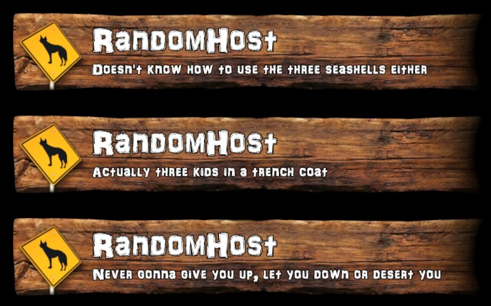
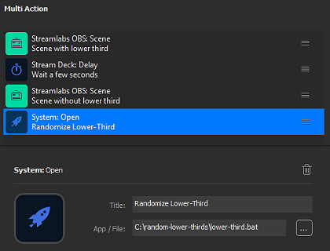

# Random Lower Thirds

<!-- TOC -->
* [1. Purpose](#1-purpose)
* [2. Example](#2-example)
* [3. How it works](#3-how-it-works)
* [4. Examples](#4-examples)
  * [4.1. Timed Lower Third with Stream Deck, OBS Studio and scene transition](#41-timed-lower-third-with-stream-deck-obs-studio-and-scene-transition)
* [5. Credits](#5-credits)
* [6. License](#6-license)
<!-- TOC -->

## 1. Purpose

This package contains a couple of files you can use to implement [lower thirds][1] with
**randomized texts** in your streaming software.

It should work with **any** streaming software which is capable of reading and rendering text from
plain text files, such as:

* [Elgato Game Capture][2]
* [OBS Studio][3]
* [Streamlabs Desktop][4]
* [XSplit][5]

**Note:**  
This package is currently targeted at **Windows** users. If you are streaming from a different
operating system like Linux or macOS, there are probably better (native) tools at your disposal.

## 2. Example

## 3. How it works

You will be working with the following files:

| File                    | Description                                        |
|-------------------------|----------------------------------------------------|
| `lower-third.bat`       | Windows batch script which must be executed        |
| `lower-third.txt`       | Text file containing the randomly selected text    |
| `lower-third-lines.txt` | Text file containing the text lines to choose from |

When executed, `lower-third.bat` selects a random line from `lower-third-lines.txt` (using the
bundled `randline.bat` script) and writes it to `lower-third.txt`.

`lower-third.txt` can then be added to your streaming software as a text source, ready to be used
in your lower third.

The way you design your lower thirds is completely up to you. This package just provides a facility
to have a random text line in there.

**NOTICE:**  
Depending on your streaming software, it may **take some time** to detect that `lower-third.txt` has
been updated with new content which may cause the text on your lower third to update **while** it is
already being displayed.

To avoid this, you can either add a **delay** between running `lower-third.bat` and showing your 
lower third, or you can try to run `lower-third.bat` **after** displaying your lower third. That way
the text would be randomized off-screen, with the updated text being used the next time you show the
lower third.

Which method works best highly depends on the streaming software you use and how it handles text
sources.

## 4. Examples

To give you an idea how you could use our script, this section contains some example setups.

### 4.1. Timed Lower Third with Stream Deck, OBS Studio and scene transition

**Requirements:** Elgato Stream Deck, OBS Studio

_**Note:** In more recent versions of OBS Studio, you can achieve the same effect using a combination
of **source groups** and **source show / hide transitions** without having to create a new scene._

**OBS Studio Setup**

1. **Create** a new **scene** and give it a suitable name (e.g. *"Cam + Lower Third"* ).
2. **Add** a new **scene source** and choose the scene on top of which you would like to layer the
   lower third (e.g. *"Cam"* ).
3. **Add** a new **media source** and select your pre-designed **lower third**. This could be an
   image or a video you designed yourself or one you got from the web which contains the visuals for
   your lower third.
4. **Add** `lower-third.txt` from this package as a **text source** to your *"Cam + Lower Third"* scene.
5. Setup custom **scene transitions** for both scenes:
    * **Luma Wipe** for switching from *"Cam"* to *"Cam + Lower Third"*
    * **Inverted** Luma Wipe for switching back from *"Cam + Lower Third"* to *"Cam"*

Using scenes with custom "scene-to-scene" transitions allows you to animate your lower thirds so they 
"roll" into and out of view.

**Stream Deck Setup**

1. Set up a **Multi Action** in Stream Deck.
2. Add an **OBS Studio: Scene** action which switches to your *"Cam + Lower Third"* scene.
3. Add a **Stream Deck: Delay** action with a delay of about *6000* milliseconds so the average
   viewer has enough time to read the lower third without getting distracted.
4. Add an **OBS Studio: Scene** action which switches back to your *"Cam"* scene.
5. Add a **System: Open** action which runs `lower-third.bat`. 

Your setup should now look similar to this:

## 5. Credits

This package contains the 3rd party component `randline.bat` created by [Paul Houle][6].

## 6. License

See [LICENSE.txt](LICENSE.txt) for full license details.

[1]: https://en.wikipedia.org/wiki/Lower_third
[2]: https://www.elgato.com
[3]: https://obsproject.com
[4]: https://streamlabs.com
[5]: https://www.xsplit.com
[6]: http://paulhoule.com
